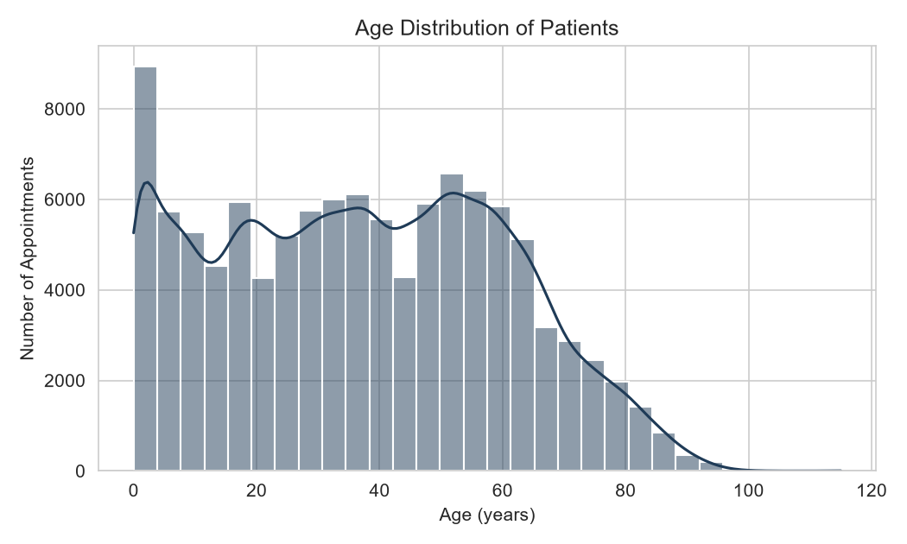
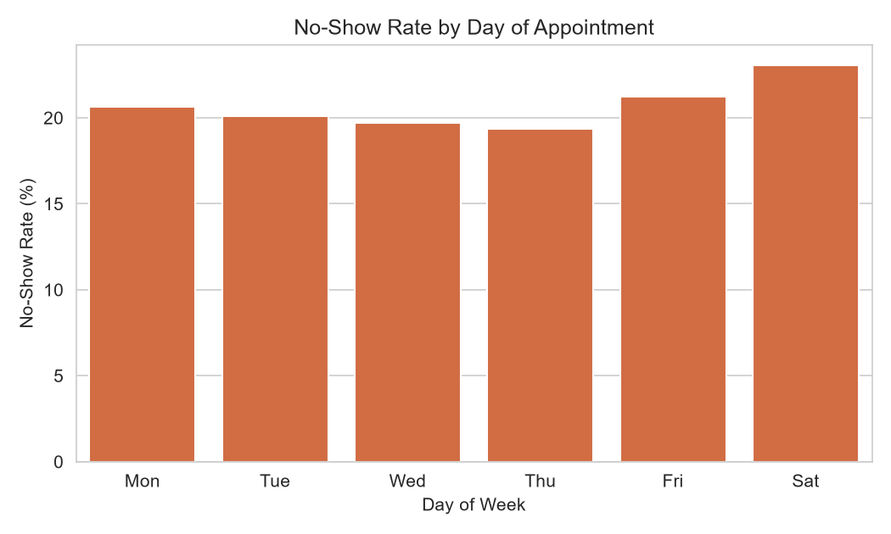
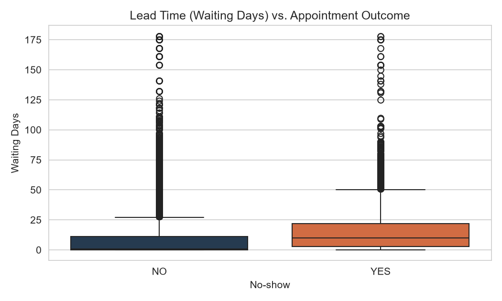
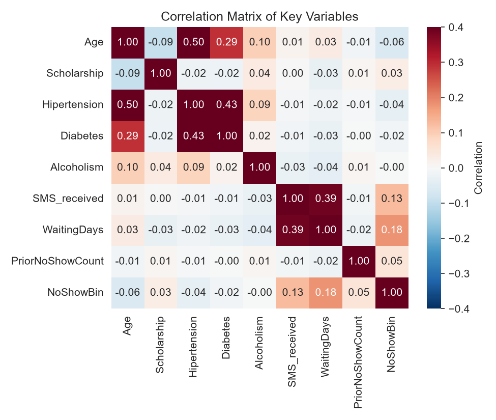
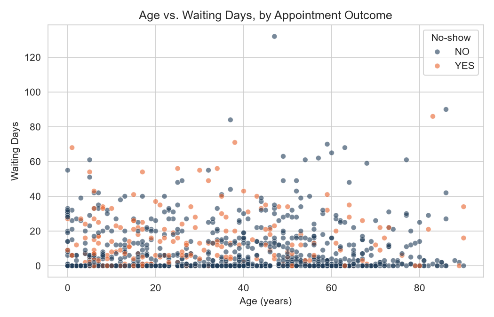
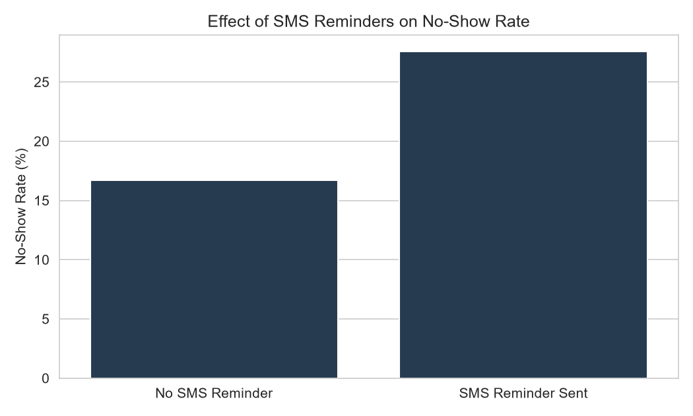
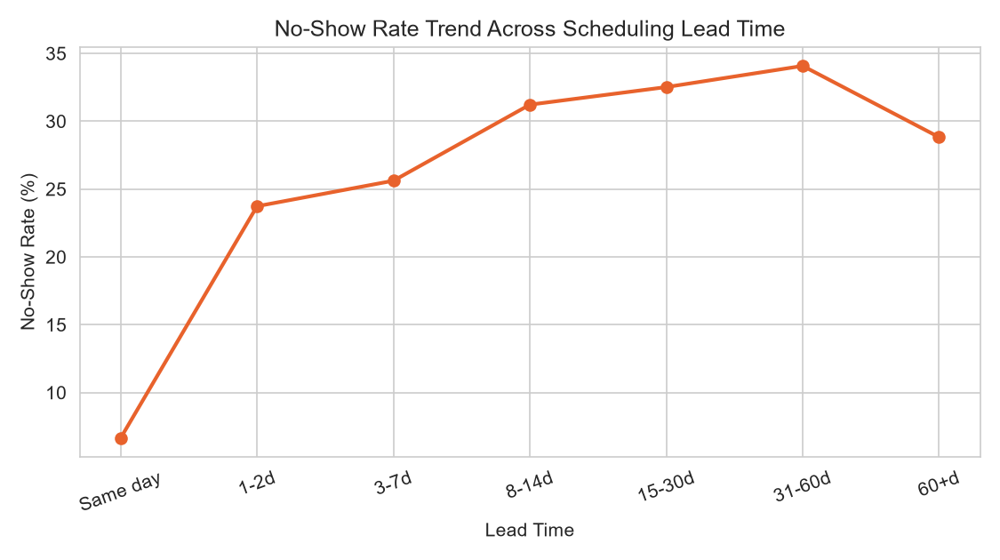
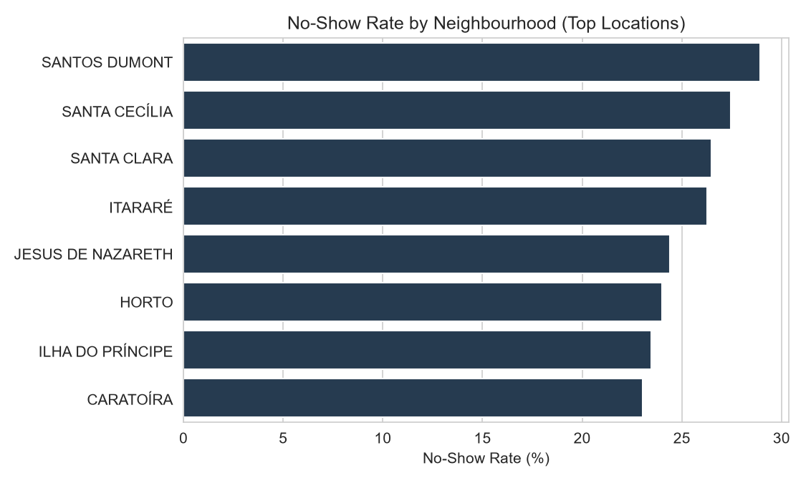

# Patient No-Show Analysis

## Project Overview

This project analyzes patient appointment data to understand the factors associated with missed medical appointments.

The analysis was performed using **Python, Pandas, NumPy, Matplotlib, and Seaborn**. The project includes data cleaning, feature engineering, exploratory data analysis (EDA), statistical analysis, and visualization.

The final dataset and charts are generated automatically using the Python analysis script.

## Objectives

* Clean and prepare patient appointment data.
* Analyze patient demographics and appointment patterns.
* Calculate the overall patient no-show rate.
* Study the relationship between waiting time and no-shows.
* Analyze the impact of SMS reminders.
* Compare no-show rates across age groups and neighbourhoods.
* Identify patterns using correlation analysis.
* Create meaningful visualizations from the analysis.

## Dataset

The dataset contains medical appointment information including:

* Patient ID
* Appointment ID
* Gender
* Scheduled Day
* Appointment Day
* Age
* Neighbourhood
* Scholarship
* Hypertension
* Diabetes
* Alcoholism
* Handicap
* SMS Received
* No-show status

The dataset is based on the **Medical Appointment No Shows** dataset from Kaggle.

## Data Cleaning

The Python script performs the following cleaning operations:

* Removes duplicate records.
* Standardizes text values.
* Converts date columns into datetime format.
* Handles invalid patient ages.
* Fills missing neighbourhood values.
* Removes records with invalid dates.
* Converts binary columns into numeric values.
* Handles inconsistent values in categorical columns.

## Feature Engineering

The project creates several new features to improve the analysis.

### WaitingDays

Calculates the number of days between the scheduled date and appointment date.

### DayOfWeek

Extracts the day of the week from the appointment date.

### AgeGroup

Patients are divided into:

* 0–17
* 18–35
* 36–60
* 60+

### LeadBucket

Waiting time is grouped into:

* Same day
* 1–2 days
* 3–7 days
* 8–14 days
* 15–30 days
* 31–60 days
* 60+ days

### ChronicConditionFlag

Identifies whether a patient has hypertension, diabetes, or alcoholism.

### NoShowBin

Converts the no-show status into a binary value for analysis.

### PriorNoShowCount

Calculates the number of previous no-shows for each patient.

## Exploratory Data Analysis

The project analyzes:

* Patient age distribution
* Overall no-show rate
* No-show rate by gender
* No-show rate by age group
* SMS reminder impact
* No-show rate by appointment lead time
* Neighbourhood-level no-show rates
* Waiting time and appointment outcomes
* Correlation between important variables

## Visualizations

The analysis generates the following charts in the `output_charts/` folder.

<p align="center">
  
  
</p>

<p align="center">
  
  
</p>

<p align="center">
  
  
</p>

<p align="center">
  
  
</p>

### Charts Included

1. **Age Distribution** – Distribution of patient ages.
2. **No-Show Rate by Day** – No-show rate across appointment days.
3. **Waiting Days vs Appointment Outcome** – Relationship between waiting time and attendance.
4. **Correlation Heatmap** – Correlation between important numerical variables.
5. **Age vs Waiting Days** – Relationship between patient age and waiting time.
6. **SMS Reminder Effect** – Appointment outcomes based on SMS reminders.
7. **Lead-Time Trend** – No-show rates across different waiting-time groups.
8. **Neighbourhood No-Show Rate** – No-show rates across neighbourhoods.

## Technologies Used

* Python
* Pandas
* NumPy
* Matplotlib
* Seaborn
* Jupyter Notebook / VS Code
* GitHub

## Project Structure

```text
patient-no-show-analysis/
│
├── patient_no_show_analysis.py
├── cleaned_patient_appointments.csv
├── README.md
│
└── output_charts/
    ├── 01_age_distribution.png
    ├── 02_noshow_by_day.png
    ├── 03_waitingdays_boxplot.png
    ├── 04_correlation_heatmap.png
    ├── 05_scatter_age_waitingdays.png
    ├── 06_sms_effect.png
    ├── 07_leadtime_trend.png
    └── 08_neighbourhood_noshow_rate.png
```

## How to Run the Project

### 1. Clone the repository

```bash
git clone YOUR_GITHUB_REPOSITORY_URL
```

### 2. Open the project folder

```bash
cd patient-no-show-analysis
```

### 3. Install required libraries

```bash
pip install pandas numpy matplotlib seaborn
```

### 4. Run the Python script

```bash
python patient_no_show_analysis.py
```

The script will generate:

* `cleaned_patient_appointments.csv`
* Visualization charts inside the `output_charts/` folder

## Key Skills Demonstrated

* Data Cleaning
* Data Manipulation
* Exploratory Data Analysis
* Feature Engineering
* Data Visualization
* Statistical Analysis
* Python Programming
* Pandas
* NumPy
* Matplotlib
* Seaborn
* GitHub Project Management

## Conclusion

This project demonstrates how Python can be used to clean, transform, analyze, and visualize healthcare appointment data.

The analysis focuses on identifying patterns related to patient no-shows, including waiting time, age, SMS reminders, previous no-show behavior, and neighbourhood.

The project provides practical experience in the complete data analysis workflow, from raw data preparation to generating insights and visualizations.

## Author

**Tanisha Verma**

B.Tech CSE | Aspiring Data Analyst

Skills: Python | SQL | Excel | Power BI
